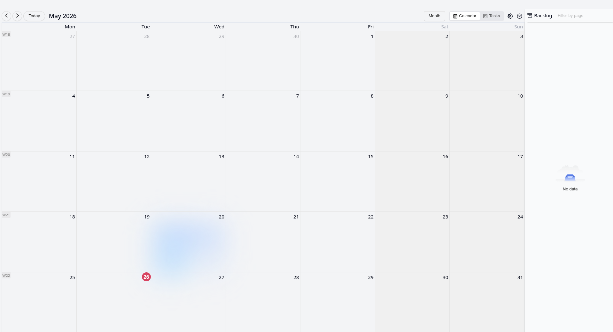

# logseq-google-agenda

Read-only Google Calendar and journal task month view for Logseq using public or private iCal URLs.

## Features

- Import one or more Google Calendar feeds from public or private `.ics` URLs.
- Render separate `Calendar` and `Tasks` month tabs inside the Logseq plugin main view.
- Show imported iCal events in `Calendar` and open Logseq journal-page tasks in `Tasks`.
- Use a reference-inspired month layout with a consistent month grid for both tabs.
- Show a selected-day sidebar with event title, calendar name, and time.
- Open or focus the plugin panel from the command palette or `Ctrl+Shift+G` / `Cmd+Shift+G`, and close it from the panel close control.
- Refresh from the toolbar or the command palette.
- Refresh automatically on the configured interval and keep the last snapshot cached locally.
- Export imported events into Logseq journal pages under a `Google Agenda` block during refresh.
- No OAuth flow, event editing, or calendar CRUD support.

## Screenshot

- 

## Installation

1. Clone this repository.
2. Run `npm install`.
3. Run `npm run build`.
4. In Logseq, open `Plugins` -> `Load unpacked plugin`.
5. Select this repository folder.

Logseq loads the plugin UI from the built `dist/` assets, so rebuild after local code changes.

## Settings

The plugin registers these Logseq settings:

- `Calendar feeds`: JSON array of feed objects with `url`, `calendarName`, and optional `color`.
- `Refresh interval (minutes)`: positive number used for the automatic refresh loop.

Example `Calendar feeds` value:

```json
[
  {
    "url": "https://calendar.google.com/calendar/ical/.../basic.ics",
    "calendarName": "Team",
    "color": "#3b82f6"
  },
  {
    "url": "https://calendar.google.com/calendar/ical/.../private-abcdef/basic.ics",
    "calendarName": "Personal"
  }
]
```

Notes:

- The plugin reads calendar data from iCal feeds only.
- Feed fetch failures are shown in the sync-issue banner without dropping healthy feeds.
- The current plugin entrypoint runs journal export during refresh and writes managed child blocks under `Google Agenda` on journal pages.

## Usage

- Open the plugin panel in Logseq.
- Use `Open Google Agenda` from the command palette or press `Ctrl+Shift+G` / `Cmd+Shift+G` to show and focus the panel, and use the panel close control to dismiss it.
- Switch between the `Calendar` tab for imported iCal events and the `Tasks` tab for open tasks collected from Logseq journal pages.
- Use `Prev`, `Next`, and `Today` to move around the reference-inspired month grid.
- Click any day to inspect its events in the right sidebar.
- Use `Refresh Google Agenda` from the command palette or the toolbar to fetch the latest data.
- Empty days show `No data` in the sidebar.

## Development

- `npm run test`
- `npm run typecheck`
- `npm run build`
- `npm run dev` starts the Vite dev server for local UI work.

## Reference

- https://github.com/haydenull/logseq-plugin-agenda
